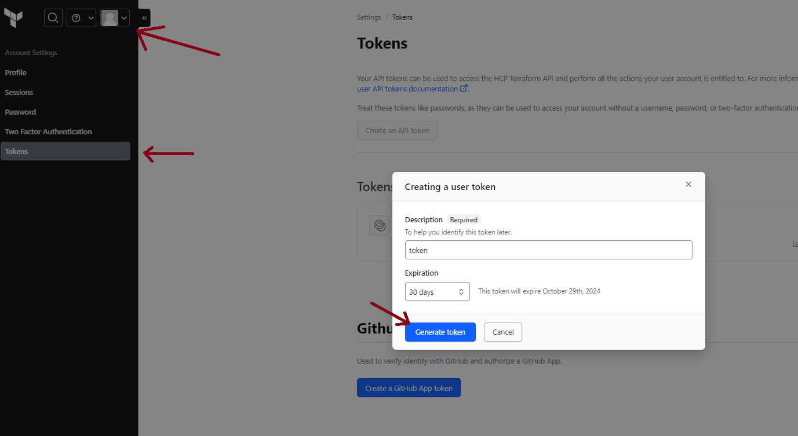

# Terraform Organization and Workspace Setup

This README provides instructions to create a Terraform organization and workspace using Terraform.

## Prerequisites

- A Terraform Cloud account. You can sign up at [Terraform Cloud](https://app.terraform.io/signup).
- Terraform CLI installed. Download it from [Terraform Downloads](https://www.terraform.io/downloads.html) or use [tfenv](https://github.com/tfutils/tfenv)
- A valid API token for Terraform Cloud. You can create one in your account settings.
<br><br>


<br>

## Step 1: Configure Your Environment

1. **Create a `provider.tf` File**
- Create a `provider.tf` file with the following content:

     ```hcl
        terraform {
        required_providers {
            tfe = {
            version = ">= 0.57.0"
                }
            }
        }

        provider "tfe" {
            hostname = "app.terraform.io
            token    = "Your API Token"
        }
     ```

2. **Create a `main.tf` File**
   - Create a `main.tf` file with the following content:

     ```hcl
        resource "tfe_organization" "test-organization" {
            name  = var.organization_name
            email = var.email
        }

        resource "tfe_workspace" "count" {
            count        = length(var.workspace_name)
            name         = var.workspace_name[count.index]
            organization = tfe_organization.test-organization.name
            tag_names    = var.tags
        }
     ```

3. **Create a `variables.tf` File**
   - Create a `variables.tf` file to define your variables:

     ```hcl
        variable "organization_name" {
            type        = string
            description = "The TFE Organization Name."
            default     = "azure-org-learning"
        }

        variable "email" {
            type        = string
            description = "The admin email."
        }

        variable "workspace_name" {
            type        = list(string)
            description = "The name of the Workspace."
            default     = ["dev", "stage", "test", "prod"]
        }

        variable "tag_names" {
            type        = list(string)
            description = "The tag names"
            default     = ["azure", "workspace", "environment"]
        }

        variable "hostname" {
            type        = string
            description = "The HCP Terraform or Terraform Enterprise hostname to connect to. Defaults to app.terraform.io"
            default     = "app.terraform.io"
        }

        variable "token" {
            type        = string
            description = "The token used to authenticate with HCP Terraform or Terraform Enterprise"
        }
    
## Step 2: Initialize and Apply Terraform

1. **Initialize Terraform**
   - Run the following command to initialize your Terraform working directory:
     ```bash
     terraform init
     ```

2. **Create a `terraform.tfvars` File**
   - Create a `terraform.tfvars` file to provide values for your variables:

     ```hcl
     token = "your_api_token"
     email = "your_tfe_admin_email"
     ```

3. **Plan and Apply the Configuration**
   - Run the following commands to plan and apply your configuration:
     ```bash
     terraform plan
     terraform apply
     ```

   - Confirm the action when prompted.

## Conclusion

You have successfully created a Terraform organization and workspace using Terraform. You can now manage your infrastructure as code with Terraform Cloud.

For more detailed information, refer to the official Terraform documentation at [Terraform Documentation](https://www.terraform.io/docs/index.html).